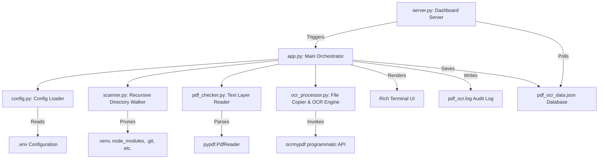

# pdfocr Workspace Guidelines & Architecture (AGENTS.md)

Welcome to the `pdfocr` codebase. This document outlines the project's system architecture, modular components, frontend UI specifications, design systems, coding standards, and testing procedures. Review this document before making any changes.

---

## 1. System Overview & Objectives

`pdfocr` is a local utility designed to recursively scan folder paths for PDF documents, check if they contain a readable text layer, copy non-searchable (scanned-only) PDFs to an isolated subdirectory, and run Tesseract OCR on them to make them text-searchable.

### Core Objectives

1. **No Overwrites**: Original source PDFs must never be modified.
2. **Performance**: Large network shares (NAS) must be scanned efficiently by avoiding deep traversal of developer directories (e.g. `venv`, `node_modules`, `.git`).
3. **Live Progress**: The CLI and local Web UI must report live indexing and execution status without hanging.
4. **Rich Aesthetics**: The Dashboard Web UI must look premium, modern, responsive, and provide side-by-side comparison previews.

---

## 2. Architecture & Module Structure



### Module Directory & Roles

* [app.py](file:///home/dlh/dlhdev/pdfocr/app.py): Coordinates the execution. Parses CLI arguments, checks `.env` settings, executes directory scans, logs activities, and writes stats to `pdf_ocr_data.json`.
* [config.py](file:///home/dlh/dlhdev/pdfocr/config.py): Validates env settings (`SCAN_DIRECTORIES`, `OCR_SUBFOLDER`, `LOG_FILE`, `OCR_LANG`, `FORCE_OCR`).
* [scanner.py](file:///home/dlh/dlhdev/pdfocr/scanner.py): Performs directory discovery using `os.walk`, dynamically pruning directories in `DEFAULT_IGNORE_DIRS` and `OCR_SUBFOLDER` to ensure high speeds over network shares.
* [pdf_checker.py](file:///home/dlh/dlhdev/pdfocr/pdf_checker.py): Opens PDFs using `pypdf.PdfReader` and counts alphanumeric character length across pages. If the sum is $\ge 20$ (default threshold), it is marked as searchable.
* [ocr_processor.py](file:///home/dlh/dlhdev/pdfocr/ocr_processor.py): Creates the configured subfolder (default `_newOCR`), copies the original file, and executes the `ocrmypdf` library programmatically.
* [server.py](file:///home/dlh/dlhdev/pdfocr/server.py): A custom lightweight HTTP server running on port `44683`. Binds to `0.0.0.0` for local network access and manages static routing and file endpoints.
* [static/](file:///home/dlh/dlhdev/pdfocr/static): Contains client-side dashboard resources (`index.html`, `style.css`, `script.js`).

---

## 3. UI/UX Design System & Layout Guidelines

The Web UI adopts a modern, glassmorphic, dark-mode design system utilizing a dark violet/blue palette, neon highlights, and CSS backdrop-filters.

### Visual Styling & Colors (CSS Variables)

All UI interfaces must adhere to the design tokens declared in [style.css](file:///home/dlh/dlhdev/pdfocr/static/style.css):

| CSS Variable | Value | Role |
| :--- | :--- | :--- |
| `--bg-dark` | `#090b11` | Primary body background |
| `--bg-card` | `rgba(20, 26, 42, 0.45)` | Glass container cards |
| `--bg-sidebar` | `rgba(13, 17, 28, 0.7)` | Nav sidebar background |
| `--border-glass` | `rgba(255, 255, 255, 0.08)` | Subtle border outlines |
| `--border-glow` | `rgba(0, 242, 254, 0.15)` | Glowing card hover frames |
| `--text-main` | `#f8fafc` | Primary typography color |
| `--text-dim` | `#94a3b8` | Subtext and captions |
| `--neon-blue` | `#00b4db` | General primary brand color |
| `--neon-cyan` | `#00f2fe` | Accent highlight / secondary brand |
| `--neon-green` | `#10b981` | Success badges / statistics |
| `--neon-red` | `#ef4444` | Errors / check failures |

### Component Typography

* **Fonts**: `Inter` for general text, `Outfit` for main titles, numbers, logo headings, and brand accents.
* **Titles**: Background gradient text (Linear Gradient `135deg` from `--neon-blue` to `--neon-cyan`) applied to brand logo with `-webkit-background-clip: text` and transparent text fill.

### Component Details

1. **Sidebar**: Fixed-width (`280px`), vertical navigation menu with clean emojis. Interactive items transition their border and background on hover. Selected item matches `--neon-cyan` background glow (`rgba(0, 242, 254, 0.08)`).
2. **Metrics Grid**: 4 columns representing total PDFs, percent searchable, succeeded OCR conversions, and failed checks. Each card has a `transition: all 0.3s ease`, scale-ups (`1.02`), and neon border/shadow glow adjustments on hover.
3. **Data Tables**: Compact layouts with sticky headers. Text overflows are truncated cleanly with tooltips using standard CSS `text-overflow: ellipsis`.
4. **Badge Statuses**: Curated color-coded labels indicating scanning states and file classifications:
    * `Idle`: Muted grey background (`rgba(148, 163, 184, 0.1)`).
    * `Scanning` / `Processing`: Light blue with custom pulse animation (`pulse-glow`).
    * `Searchable` / `Completed`: Success green badge.
    * `Unsearchable` / `OCR Failed`: Error red badge.
5. **Side-by-side Document Preview**: Renders when clicking "Compare Preview" or "Inspect Original". Contains two `<iframe>` components: one loading the original scan (unsearchable) and one loading the newly OCR'd searchable PDF via `/files/` endpoint.
    * *Interaction Note*: On loading, the preview panel shifts into view using `scrollIntoView({ behavior: 'smooth', block: 'start' })`.

---

## 4. Frontend-Backend Integration

All requests between [script.js](file:///home/dlh/dlhdev/pdfocr/static/script.js) and [server.py](file:///home/dlh/dlhdev/pdfocr/server.py) use basic web APIs. Avoid introducing external UI scripts or build wrappers (e.g. React, Webpack) unless explicitly required by the user.

### API Specifications

#### 1. Heartbeat Synchronization

* **Endpoint**: `POST /api/heartbeat`
* **Payload**: None
* **Response**: `{"status": "ok", "time": float, "scanning": boolean}`
* **Behavior**: Sent every 2.5 seconds to refresh server active timestamps and prevent web session timeouts.

#### 2. Trigger Scan

* **Endpoint**: `POST /api/scan`
* **Payload**: None
* **Response**: `{"status": "ok", "message": "Scan started"}` (200 OK) or `{"status": "error", "message": "Scan already in progress"}` (400 Bad Request).
* **Behavior**: Spawns a background worker thread executing `run_scan(console_output=False)` to prevent blocking HTTP handler.

#### 3. System Stats & Logs

* **Endpoint**: `GET /api/stats`
* **Response**: A merged state JSON containing:

    ```json
    {
      "last_scan_time": "ISO-Timestamp",
      "config": {
        "scan_directories": ["/path1", "/path2"],
        "ocr_subfolder": "_newOCR",
        "log_file": "pdf_ocr.log",
        "ocr_lang": "eng",
        "force_ocr": false
      },
      "stats": {
        "total_pdfs": 10,
        "already_searchable": 8,
        "ocr_succeeded": 2,
        "ocr_failed": 0
      },
      "directories": [...],
      "files": [...]
    }
    ```

* **Behavior**: Polled every 3 seconds to keep UI metrics, tables, progress, and settings current.

#### 4. Secure File Access

* **Endpoint**: `GET /files/<url_encoded_absolute_path>`
* **Headers**: `Content-Type: application/pdf`
* **Behavior**: Reads PDF files and stream-pipes them in `64KB` chunks. Checks path constraints: must exist, be a file, and end with `.pdf` (case-insensitive) to prevent local file inclusion (LFI) vulnerabilities.

---

## 5. Coding & Security Rules

### General Development Guidelines

1. **Strict Path Verification**: Always resolve and check directory paths using Python `pathlib.Path.resolve()`. Ensure all input paths exist before triggering scanner functions.
2. **Isolated Storage**: All files processed during OCR must reside inside the `OCR_SUBFOLDER` under the file's parent directory. Never edit or overwrite the original source PDF files.
3. **Concurrency Safety**:
    * Scanning operations must run in separate background threads (e.g. `threading.Thread`) so HTTP handler loops do not block.
    * Use a global state boolean `IS_SCANNING` to reject concurrent scanner triggers.
4. **Logging Practices**: Log scanner states, PDF check results, conversion status, errors, and critical exceptions to the log file configured in `.env`. Suppress HTTP request logging spam in the server command line console to maintain readability.
5. **Tesseract Library Validation**: Always check that system libraries (Tesseract, Ghostscript) and pip requirements are verified during setup.

---

## 6. Testing & Quality Assurance

### Automated Testing Structure

Automated test assertions are handled under [test_app.py](file:///home/dlh/dlhdev/pdfocr/test_app.py) using the Python `unittest` framework.

* **PDF Generation**: Avoid committing real binaries. The test suite uses the `reportlab` canvas API inside `setUp()` to dynamically generate:
    1. A searchable PDF containing explicit text lines (`drawString`).
    2. A non-searchable PDF containing only shapes/rectangles (no searchable text).
    3. A corrupted PDF containing random non-conforming characters.
* **Mocks**: Mock `ocrmypdf.ocr` using standard `unittest.mock.patch` to verify file outputs, copy assertions, and exception scenarios without needing local Tesseract binaries in CI environments.
* **Testing Commands**:
  * To run the test suite:

        ```bash
        python -m unittest test_app.py
        ```

  * To generate dummy PDFs for manual dashboard validation:

        ```bash
        python generate_test_environment.py
        ```

### Manual Verification Checklist

1. Verify folders like `venv`, `.git`, and `node_modules` are successfully skipped and that the counter increments correctly.
2. Inspect files in the File Log tab: searchable files must render a preview directly, while converted files must load a side-by-side split screen comparision showing both the original and OCR versions.
3. Shut down the dashboard browser window and check that the console server exits gracefully when pressing `Ctrl+C`.
