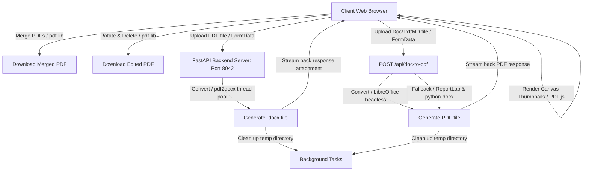

# PDF Tools Web Application

PDF Tools is a fast, secure, and responsive local web application designed to handle common PDF manipulations on your local machine and local network. It runs on port `8042`.

---

## Use Cases

1. **Combining Documents (Merge)**: Merging reports, essays, scan pieces, or receipts from different sources into a single continuous PDF file.
2. **Document & Image Organization (Rotate, Delete & Reorder Pages)**:
   - Creating a custom PDF by combining pages from multiple PDFs and images (JPG, PNG, WEBP, GIF, SVG).
   - Fixing page orientations (e.g., upside-down or sideways pages resulting from physical scanner feeds).
   - Deleting unnecessary placeholder pages, separator sheets, or blank pages before sharing or archiving a document.
3. **Format Migration (PDF to Word Document)**: Migrating standard PDF documents to editable Microsoft Word files (`.docx`) for quick editing, layout updates, or extraction of text and tables.
4. **Document to PDF Conversion**: Converting Word documents (`.docx`, `.doc`), plain text (`.txt`), and Markdown (`.md`) files into highly formatted, print-ready PDF files.
5. **Local Network Sharing**: Accessing the tools from secondary devices (like a tablet or phone connected to a home/office Wi-Fi network) to process files directly from those device storage folders without transferring them to a computer first.

---

## System Architecture

The application adopts a **hybrid client-server architecture** to optimize performance, maintain strict privacy, and keep system overhead low:



### Client-Side Processing (Merge, Rotate, Delete, Reorder & Image Embedding)
To eliminate upload latency, reduce server CPU load, and guarantee data privacy, core page manipulations are performed **entirely client-side** inside the browser using `pdf-lib` and `pdfjs-dist`:
- **Thumbnail Rendering**: The browser extracts pages using `pdfjs-dist` (PDF.js) and draws them to HTML5 `<canvas>` nodes. Images are read directly as Data URLs, processed via HTML5 Canvas to ensure compatibility (converting to standard JPEGs or PNGs), and rendered instantly as page cards.
- **Assembly & Edit**: All deletion, rotation, and reordering logic is tracked in browser memory. When exporting, `pdf-lib` compiles pages from the source PDF ArrayBuffers and embeds the uploaded image files to build the final PDF document. The download is initiated in-browser without sending raw file data over the network.

### Server-Side Processing (PDF to Word & Document to PDF)
Advanced layouts and document parsing operations are handled by the server:
- **PDF to Word**: Reconstructs paragraphs, tables, and images from PDF to `.docx` via a `pdf2docx` converter pool.
- **Document to PDF**: Converts Word, text, and Markdown files to PDF using **headless LibreOffice** for layout and style fidelity. If LibreOffice is not installed, the server automatically falls back to a **pure-Python PDF renderer** powered by `ReportLab` and `python-docx` for `.docx`, `.txt`, and `.md` (compiled through custom HTML/Markdown platypus parsers).
- **Dynamic Cleanup**: Generated output assets are securely cleaned up from disk space via `BackgroundTasks` once the browser download concludes.

---

## Feature Dependencies

The project uses the following dependencies pinned to ensure stable environments:

### Frontend (npm packages)
* **`react` & `react-dom`**: Frontend framework for state management and DOM rendering.
* **`pdf-lib` (v1.17.1)**: Performs client-side PDF loading, page extraction, copying, rotation, and serialization.
* **`pdfjs-dist` (v4.3.136)**: Handles parsing of PDF files and rendering page previews to canvas elements inside the browser.
* **`lucide-react` (v0.395.0)**: Icons for the dashboard and UI buttons.

### Backend (Python packages)
* **`fastapi` (v0.111.0)**: High-performance web framework.
* **`uvicorn` (v0.30.1)**: ASGI server to run FastAPI.
* **`python-multipart` (v0.0.9)**: Enables streaming of multi-part form file uploads.
* **`pdf2docx` (v0.5.8)**: Python library that converts PDFs to docx files. It depends on `PyMuPDF` (layout extraction) and `python-docx` (Word file generation).
* **`markdown` (v3.6.0)**: Converts Markdown files into structured HTML content.
* **`reportlab` (v4.5.1)**: Pure-Python PDF generation library used for fallback layout rendering.
* **`mammoth` (v1.12.0)**: Fast .docx-to-HTML text extractor.

---

## Implementation Details

### Project Directory Structure
```
/home/dlh/dlhdev/pdftools/
├── backend/
│   ├── main.py             # FastAPI backend (endpoints, middleware, serving statics)
│   └── requirements.txt     # Python backend dependencies
├── dist/                    # Compiled production static frontend assets
├── src/
│   ├── components/
│   │   ├── MergeTab.tsx    # Drag-and-drop merge component
│   │   ├── OrganizeTab.tsx # PDF page rotation and deletion component
│   │   ├── ConvertTab.tsx  # PDF-to-Word upload and progress UI
│   │   ├── DocToPdfTab.tsx # Word/Text/Markdown to PDF conversion component
│   │   └── NetworkInfo.tsx # Local network connection instructions component
│   ├── utils/
│   │   └── pdf.ts          # PDF.js and pdf-lib utility functions
│   ├── App.tsx             # Main React entry dashboard
│   ├── App.css             # Glassmorphic CSS style definitions
│   ├── index.css           # Global template reset styles
│   └── main.tsx            # React initialization
├── index.html               # Main page layout containing Outfit & Inter Google Fonts
├── vite.config.ts          # Vite configuration with /api reverse proxy settings
├── package.json             # Frontend NPM dependency configurations
├── setup.sh                 # Installation script
├── run.sh                   # Application startup wrapper
└── shutdown.sh              # Termination script
```

### Security Configurations
- **Path Traversal Protection**: Uploaded files are stripped of paths using `os.path.basename` and immediately renamed to a random `uuid.uuid4()` string. Files are never stored under their original name or processed in paths containing user-controlled directories.
- **Header & Format Verification**: Verifies uploaded files against their format constraints: `%PDF-` magic bytes check for PDFs, `PK\x03\x04` zip header checks for `.docx`, OLE headers check for `.doc`, and validates plain text format (binary stream checking) for `.txt` and `.md`. Non-conforming uploads are immediately rejected with a `400 Bad Request`.
- **Clickjacking Protection**: The server middleware sets `X-Frame-Options: DENY` on all responses, blocking frame nesting.
- **Content Sniffing Mitigation**: Response header `X-Content-Type-Options: nosniff` is enforced, blocking browsers from executing files with mismatched mime-types.
- **Content Security Policy (CSP)**: Limits script, style, connection, and image asset sources to `'self'`, google fonts APIs, and base64 data URLs.
- **Automatic Disk Cleanup**: The backend registers FastAPI background tasks to securely wipe temporary directories (`shutil.rmtree`) after files are downloaded, mitigating disk denial-of-service attempts.

---

## Setup and Management Scripts

Three scripts are provided at the root directory to manage the application lifecycle:

### 1. Installation (`setup.sh`)
Verifies system dependencies (Node, npm, Python3), installs npm modules, compiles frontend assets into static files, initializes a Python virtual environment (`venv`), and installs Python requirements.
```bash
./setup.sh
```

### 2. Startup (`run.sh`)
Activates the virtual environment and starts the FastAPI/Uvicorn server.
* **Local Host Mode** (default): Runs on `127.0.0.1:8042` (accessible only from the host machine):
  ```bash
  ./run.sh
  ```
* **Local Network Mode**: Exposes the server on `0.0.0.0:8042` (accessible to other devices on the same Wi-Fi/Ethernet network):
  ```bash
  ./run.sh --network
  ```

### 3. Shutdown (`shutdown.sh`)
Finds any active process running on port `8042` or matching the uvicorn command pattern, sends a polite termination signal (`SIGTERM`), and falls back to a force-kill (`SIGKILL`) if the process doesn't shut down within 5 seconds.
```bash
./shutdown.sh
```
